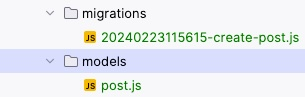
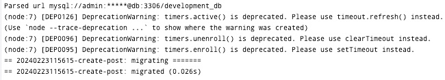
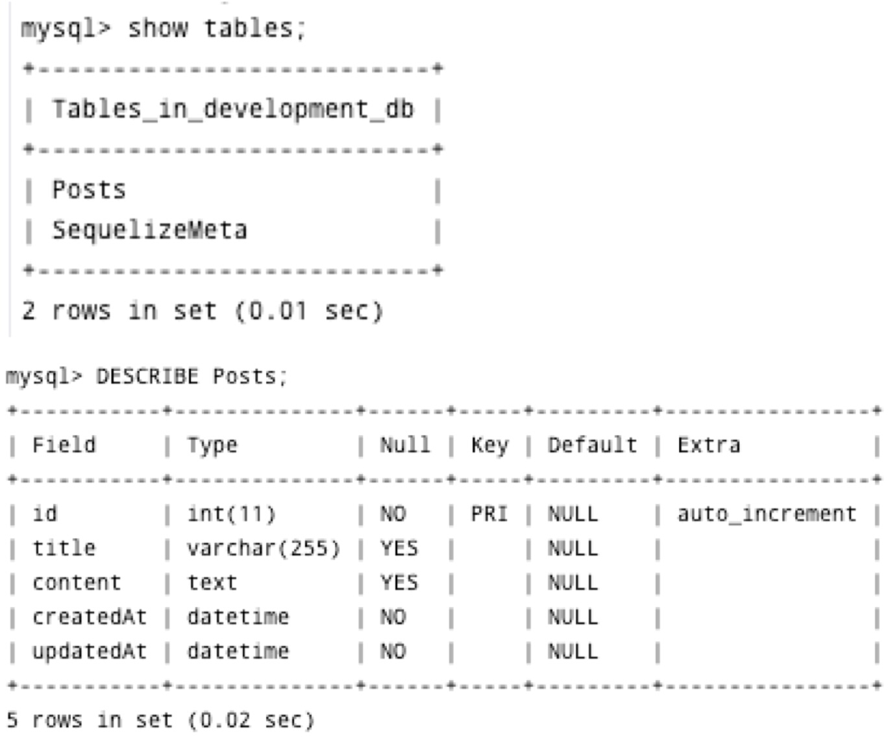
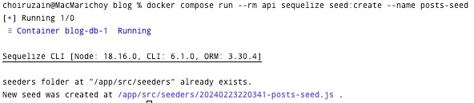
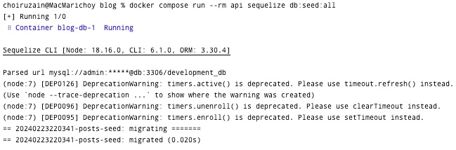
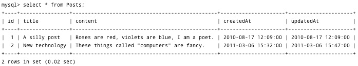
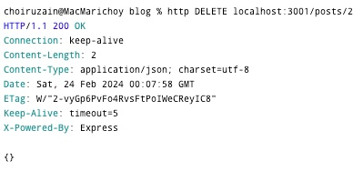

# blog-api

This repository contains the RESTful API for accessing the blog database.
## clone

```
git clone https://github.com/choiruzain-latrobe/Lab-7-.git
```


## mock-rest-server
```
cd mock-rest-server
docker compose up --build
```

then, call the localhost 

[http:localhost:3000](http://localhost:3000/)

## blog
```
cd blog
docker compose up --build
```
## solutions

### change the routes.js 
so that it can look as follows

```javascript
const index = require('../controllers/index');
const posts = require('../controllers/posts');
const routes = {};
// Connect our controllers to specific base paths.
// For example, actions defined in our posts controller should be available at
// paths beginning with /posts.
routes.connect = (app) => {
// Use the index controller for /
app.use('/', index);
// TODO: Use the posts controller for /posts
app.use('/posts', posts) // <-- Insert this line
};
module.exports = routes;
```

Try to use HTTPie to send a request to the index endpoint (GET /posts) as follows;
```
http GET localhost:3001/posts 
```

### change the posts.js
you can create post and put http method 
```javascript
const express = require('express');
const router = express.Router();
// Index: GET /posts/
router.get('/', (req, res) => {
    res.json({ todo: 'List posts' });
});

// Show: GET /posts/:postId/
//
// Note that the path contains a variable (the :postId part). This will be
// made available as a property of the req.params object.
router.get('/:postId', (req, res) => {
    res.json({ todo: 'Show post with ID=' + req.params.postId });
});

// Destroy: DELETE /posts/:postId/
//
// Note that the path is the same as the "Show" action, but the HTTP method
// is different (we are using router.delete instead of router.get).
router.delete('/:postId', (req, res) => {
    res.json({ todo: 'Delete post with ID=' + req.params.postId });
});

// Create: POST /posts/
// TODO: Add a "Create" action
router.post('/', (req, res) => {
    res.json({ todo: 'create post with ID auto generated'});
});


// Update: PUT /posts/:postId/
// TODO: Add an "Update" action
router.put('/:postId', (req, res) => {
    res.json({ todo: 'Update post with ID=' + req.params.postId });
});
module.exports = router;
```

Then, try to call http method **post** and **put**

```
http post localhost:3001/posts/
```
and
```
http put localhost:3001/posts/2
```
# Environment variable configuration
Stop docker 

```
docker compose down
```
Create a new folder in the blog/ project directory root called **env.**
Inside this folder create a file called **mysql.env.** 
Generate password and other details (as per document guidelines), so that in the **blog/env/mysql.env** the code will look like:
```
MYSQL_USER=admin
MYSQL_PASS=b763027d3193dd897147da2c96c9417ee5d42a433f49fdd2
MYSQL_REMOTE_HOST=db
MYSQL_REMOTE_PORT=3306
```
## New Service (edit docker-compose.yml)
Modify the file as follows:
```
version: "2"
services:
  api:
    build: api
    volumes:
      - "./api:/app"
    env_file: 
      - ./env/mysql.env
    ports:
      - "3001:3000"
    links:
      - db
  db:
    image: tutum/mysql:5.6
    environment: 
      - ON_CREATE_DB=development_db 
    env_file: 
      - ./env/mysql.env 
volumes: 
  blog-db-data:
    external: false

```
## Create new file 
Create a new file, **blog/api/src/config/database.js**, so that it will look like
```javascript
// Discover Node environment (default to development)
const nodeEnv = process.env.NODE_ENV || 'development';

// Put database configuration properties into an object
const config = {
database: nodeEnv + '_db',
user: process.env.MYSQL_USER,
password: process.env.MYSQL_PASS,
host: process.env.MYSQL_REMOTE_HOST,
port: process.env.MYSQL_REMOTE_PORT,
dialect: 'mysql'
};
module.exports = config;
```


Create a new file, **blog/api/.sequelizerc.**, so that it will look like

```
const path = require('path');
const dbConfig = require('./src/config/database');

// Build the connection URL string
const connectionUrl = 'mysql://' +
dbConfig.user + ':' + dbConfig.password + '@' +
dbConfig.host + ':' + dbConfig.port + '/' + dbConfig.database;

// Export settings for the Sequelize command line tool
module.exports = {
'url': connectionUrl,
'migrations-path': path.resolve('src', 'migrations'),
'models-path': path.resolve('src', 'models'),
'seeders-path': path.resolve('src', 'seeders')
};
```
## Create sub directories
Under the **blog/api** folder, create three directories, as follows;
```
mkdir -p src/{models,migrations,seeders}
```

# Creating model

Run this command, under **blog** directory
```
docker compose run --rm api sequelize model:create --name Post --attributes title:string,content:text
```
"If the command doesn't work, double-check that you have saved .sequelizerc in the right place (it must be in the api/ folder).

If it is successful, it will create a **post.js** file, as a model definition, under the **models** directory and an **xxxcreate-post.js** file under the **migrations** directory as seen in the image below:"

<p align="center">

</p>

## Migrate to database
Run 
```bash
 docker compose run --rm api sequelize db:migrate 
```
Yo will see the output as follows
<p align="center">

</p>

It means that the post has been migrated. Note: There is no record has been posted in the table Posts. We will create this later. At the moment we just check the table in the MySQL

### check it in the MySQL
In the terminal execute the following commands:
```
docker exec -it blog-db-1 bash
```
then, come inside the MySQL terminal (adjust with the password that you saved inside **mysql.env**)
```
mysql -uadmin -pb763027d3193dd897147da2c96c9417ee5d42a433f49fdd2
```
You may go to the database development_db you have created by executing the command
```
use development_db
```

If you check in the database, you will see the Posts table has been created:

<p align="center">

</p>

## Change model definition
File: blog/api/src/models/post.js
Modify model definition to specify validations, so that the posts.js become as follows:

```javascript
'use strict';
module.exports = function(sequelize, DataTypes) {
    var Post = sequelize.define('Post', {
        title: {
            allowNull:false,
            type: DataTypes.STRING,
            validate:{notEmpty: true}},
        content:{
            alloNull:false,
            type:DataTypes.TEXT,
            validate:{notEmpty:true}},
    }, {
        classMethods: {
            associate: function(models) {
                // associations can be defined here
            }
        }
    });
    return Post;
};
```

## Create a Seeder
Note: Run in the **blog** directory.

Use the Sequelize command to create a seeder for the Post records:

```
docker compose run --rm api sequelize seed:create --name posts-seed
```
You will see that new js file **xxx-posts-seed.js** is created
<p align="center">

</p>


### Change only Up function
Note : Modify **xxx-posts-seed.js** to create 2 dummy records.

Open the file and change the content into the following script:

```javascript
module.exports = {

    up: function(queryInterface, Sequelize) {

// Define dummy data for posts
        const posts = [
        {
            title: 'A silly post',
            content: 'Roses are red, violets are blue, I am a poet.',
            createdAt: new Date('2010/08/17 12:09'),
            updatedAt: new Date('2010/08/17 12:09')
        }, 
        {
            title: 'New technology',
            content: 'These things called "computers" are fancy.',
            createdAt: new Date('2011/03/06 15:32'),
            updatedAt: new Date('2011/03/06 15:47')
        }
        ];

// Insert posts into the database
return queryInterface.bulkInsert('Posts', posts, {});
},

down: function(queryInterface, Sequelize) {

// Delete all posts from the database
return queryInterface.bulkDelete('Posts', null, {});
}
};
```

### Seed the posts
Run the following under the blog directory

```
 docker compose run --rm api sequelize db:seed:all 
```

You will see that we migrated two records into the Posts table, as seen in the screensshot below

<p align="center">

</p>

By following the same way of the instruction in the MySQL, you can see that two records have been created

<p align="center">

</p>

## Create Content in the index.js
Note: Create the blog/src/models/index.js file, and insert the following contents:

```javascript
    const Sequelize = require('sequelize');     
    // Load our database configuration     
    const dbConfig = require('../config/database');
    // Connect Sequelize to the database     
    const sequelize = new Sequelize(dbConfig.database, dbConfig.user, dbConfig.password, dbConfig);     
    // Load all of our model definitions     
    const models = {         
        Post: sequelize.import(require.resolve('./post'))     
    };
    // Store the database connection     
    models.database = sequelize;     
    // Export our model definitions     
    module.exports = models; 
```
## Post the model
Modify the **blog/api/src/controllers/posts.js** into the more detailed sequileze command

```javascript
const express = require('express');
const _ = require('lodash');
const models = require('../models');
const router = express.Router();

// Selects only the fields that are allowed to be set by users
function postFilter(obj) {
    return _.pick(obj, ['title', 'content']);
}

// Index
router.get('/', (req, res) => {
    // Return a list of the five most recent posts
    const queryOptions = {
        order: [['createdAt', 'DESC']],
        limit: 5
    };
    models.Post.findAll(queryOptions)
        .then(posts => res.json(posts))
        .catch(err => res.status(500).json({ error: err.message }));
});

// Create
router.post('/', (req, res) => {
    // Create a new post record in the database
    models.Post.create(postFilter(req.body))
        .then(post => res.json(post))
        .catch(err => res.status(422).json({ error: err.message }));
});

// Show
router.get('/:postId', (req, res) => {
    // Return the specified post record from the database
    models.Post.findById(req.params.postId)
        .then(post => res.json(post))
        .catch(err => res.status(500).json({ error: err.message }));
});

// Destroy
router.delete('/:postId', (req, res) => {
    // Delete the specified post record from the database
    models.Post.destroy({ where: { id: req.params.postId } })
        .then(() => res.json({}))
        .catch(err => res.status(500).json({ error: err.message }));
});

// Update
// TODO: Implement the update action here
router.put('/:postId', (req, res) => {
    // Update the specified post record in the database
    models.Post.findById(req.params.postId)
        .then(post => post.update(postFilter(req.body)))
        .then(post => res.json(post))
        .catch(err => res.status(422).json({ error: err.message }));
});
module.exports = router;
```

Now, try to test the new modified posts.

Go to blog directory, and run the following commands
```bash
http GET localhost:3001/posts
```
<p align="center">

</p>

```bash
http DELETE localhost:3001/posts/2
```
<p align="center">

</p>


