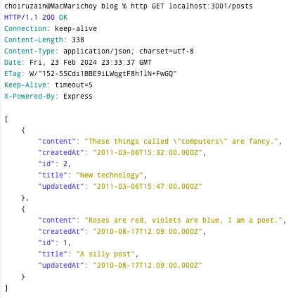

# Blog API Documentation

This repository hosts the RESTful API for accessing the `development_db` database.

## Setup Instructions

Follow these steps to set up and run the Blog API:

1. **Clone the Git Repository:**

    ```bash
    git clone https://github.com/choiruzain-latrobe/lab-7.git
    ```

2. **Run the Mock Rest Server:**
   
   Navigate to the `mock-rest-server` folder and execute the docker command:

   ```
   docker compose up --build
   ```
      
   After running the server, access it locally at [http://localhost:3000](http://localhost:3000/).
   Stop the server (Ctrl + C or Cmd+C), direct the terminal into blog directory

3. **Run the Blog Directory:**
  
   Navigate to the `blog` folder and execute the docker command:
    ```
    docker compose up --build
    ```
   We will explore the rest of the lab through this folder.
   
   You will see the **output** as follows:
   ```
   DO NOT RUN
   docker compose up --build
   
   [+] Building 4.2s (14/14) FINISHED                                                                                                                                                                 docker:desktop-linux
   => [api internal] load build definition from Dockerfile                                                                                                                                                           0.0s
   => => transferring dockerfile: 1.40kB                                                                                                                                                                             0.0s
   => [api internal] load .dockerignore                                                                                                                                                                              0.0s
   => => transferring context: 2B                                                                                                                                                                                    0.0s
   => [api internal] load metadata for docker.io/library/node:18.16.0-alpine                                                                                                                                         4.2s
   => [api 1/9] FROM docker.io/library/node:18.16.0-alpine@sha256:9036ddb8252ba7089c2c83eb2b0dcaf74ff1069e8ddf86fe2bd6dc5fecc9492d                                                                                   0.0s
   => [api internal] load build context                                                                                                                                                                              0.0s
   => => transferring context: 5.37kB                                                                                                                                                                                0.0s
   => CACHED [api 2/9] RUN apk add --no-cache tini curl bash sudo                                                                                                                                                    0.0s
   => CACHED [api 3/9] RUN mkdir -p /app                                                                                                                                                                             0.0s
   => CACHED [api 4/9] WORKDIR /app                                                                                                                                                                                  0.0s
   => CACHED [api 5/9] COPY package.json /app/                                                                                                                                                                       0.0s
   => CACHED [api 6/9] RUN npm --silent install                                                                                                                                                                      0.0s
   => CACHED [api 7/9] RUN mkdir /deps && mv node_modules /deps/node_modules                                                                                                                                         0.0s
   => CACHED [api 8/9] COPY . /app                                                                                                                                                                                   0.0s
   => CACHED [api 9/9] RUN chown -R node:node /app /deps  && echo "node ALL=(ALL) NOPASSWD:ALL" > /etc/sudoers.d/90-node                                                                                             0.0s
   => [api] exporting to image                                                                                                                                                                                       0.0s
   => => exporting layers                                                                                                                                                                                            0.0s
   => => writing image sha256:c603f545443ddee2496060210121491cd10917322b9f6eba81c68f97d411acac                                                                                                                       0.0s
   => => naming to docker.io/library/blog-api                                                                                                                                                                        0.0s
   WARN[0004] Found orphan containers ([blog-db-1]) for this project. If you removed or renamed this service in your compose file, you can run this command with the --remove-orphans flag to clean it up.
   [+] Running 1/1
   ✔ Container blog-api-1  Created                                                                                                                                                                                   0.2s
   Attaching to blog-api-1
   blog-api-1  |
   blog-api-1  | > blog-api@0.0.1 start
   blog-api-1  | > nodemon -L -x 'node --use_strict --nolazy' -e .js -w src src/server.js
   blog-api-1  |
   blog-api-1  | [nodemon] 1.11.0
   blog-api-1  | [nodemon] to restart at any time, enter `rs`
   blog-api-1  | [nodemon] watching: /app/src/**/*
   blog-api-1  | [nodemon] starting `node --use_strict --nolazy src/server.js`
   blog-api-1  | API server started
   ```

## Step by step Solutions (of Blog API)

### Configure Routes

1. Modify the `blog/api/src/config/routes.js` file as follows:

```javascript
const index = require('../controllers/index');
const posts = require('../controllers/posts');
const routes = {};
// Connect our controllers to specific base paths.
// For example, actions defined in our posts controller should be available at
// paths beginning with /posts.
routes.connect = (app) => {
// Use the index controller for /
app.use('/', index);
// TODO: Use the posts controller for /posts
app.use('/posts', posts) // <-- Insert this line
};
module.exports = routes;
```
2. Open the new terminal. Try to use HTTPie to send a request to the index endpoint (GET /posts). Run the following command in the terminal as follows;
```
http GET localhost:3000/posts 
```

You will get the output as follows:

```
http GET localhost:3000/posts

HTTP/1.1 200 OK
Connection: keep-alive
Content-Length: 21
Content-Type: application/json; charset=utf-8
Date: Tue, 23 Jul 2024 11:54:38 GMT
ETag: W/"15-Sv7OHnrfWg1qnZvSZ/j1dJv1FoQ"
Keep-Alive: timeout=5
X-Powered-By: Express

{
    "todo": "List posts"
}
```


### Update the controller `posts.js`
Update the `blog/api/src/controllers/posts.js` file with the following content where you can create post and put http method: 

```javascript
const express = require('express');
const router = express.Router();
// Index: GET /posts/
router.get('/', (req, res) => {
    res.json({ todo: 'List posts' });
});

// Show: GET /posts/:postId/
//
// Note that the path contains a variable (the :postId part). This will be
// made available as a property of the req.params object.
router.get('/:postId', (req, res) => {
    res.json({ todo: 'Show post with ID=' + req.params.postId });
});

// Destroy: DELETE /posts/:postId/
//
// Note that the path is the same as the "Show" action, but the HTTP method
// is different (we are using router.delete instead of router.get).
router.delete('/:postId', (req, res) => {
    res.json({ todo: 'Delete post with ID=' + req.params.postId });
});

// Create: POST /posts/
// TODO: Add a "Create" action
router.post('/', (req, res) => {
    res.json({ todo: 'create post with ID auto generated'});
});


// Update: PUT /posts/:postId/
// TODO: Add an "Update" action
router.put('/:postId', (req, res) => {
    res.json({ todo: 'Update post with ID=' + req.params.postId });
});
module.exports = router;
```

Then, try to call http method **post** and **put**

```bash
http post localhost:3000/posts/
```
and
```bash
http put localhost:3000/posts/2
```

The output for both of them are as follows:

```
(Query 1)

http post localhost:3000/posts/
HTTP/1.1 200 OK
Connection: keep-alive
Content-Length: 45
Content-Type: application/json; charset=utf-8
Date: Tue, 23 Jul 2024 12:02:38 GMT
ETag: W/"2d-SLuYK2Ng9thKtZ/G5U5O0Ds57hE"
Keep-Alive: timeout=5
X-Powered-By: Express

{
    "todo": "create post with ID auto generated"
}


(Query 2)

HTTP/1.1 200 OK
Connection: keep-alive
Content-Length: 32
Content-Type: application/json; charset=utf-8
Date: Tue, 23 Jul 2024 12:04:30 GMT
ETag: W/"20-3DV8Idus24MqZjFdgnJRFE/uUs8"
Keep-Alive: timeout=5
X-Powered-By: Express

{
"todo": "Update post with ID=2"
}
```

### Environment Variable Configuration
1. For configuration setup, stop the docker
```bash

docker compose down
```

The example output is as follows:

```bash
DO NOT RUN
% docker compose down 
[+] Running 2/2
 ✔ Container blog-api-1  Removed                                                                                                                                                        0.1s 
 ✔ Network blog_default  Removed   
```

2. Create a new folder called `env` within the `blog/` project directory. Inside this folder, create a file named `mysql.env` with the following content:
```
MYSQL_USER=admin
MYSQL_PASS=b763027d3193dd897147da2c96c9417ee5d42a433f49fdd2
MYSQL_REMOTE_HOST=db
MYSQL_REMOTE_PORT=3306
```

3.  Add a New Service by Modifying docker-compose.yml.

Modify the docker-compose.yml file to match the following configuration:
```
version: "2"
services:
  api:
    build: api
    volumes:
      - "./api:/app"
    env_file: 
      - ./env/mysql.env
    ports:
      - "3000:3000"
    links:
      - db
  db:
    image: tutum/mysql:5.6
    environment: 
      - ON_CREATE_DB=development_db 
    env_file: 
      - ./env/mysql.env 
volumes: 
  blog-db-data:
    external: false

```

4. Create New Files 
   
   4.1. Create the **blog/api/src/config/database.js:** file:
      
         const config = {
         database: process.env.NODE_ENV + '_db',
         user: process.env.MYSQL_USER,
         password: process.env.MYSQL_PASS,
         host: process.env.MYSQL_REMOTE_HOST,
         port: process.env.MYSQL_REMOTE_PORT,
         dialect: 'mysql'
         };
   
         module.exports = config;
      4.2. Create the **blog/api/.sequelizerc** file:

         const path = require('path');
         const dbConfig = require('./src/config/database');
         
         const connectionUrl = 'mysql://' +
             dbConfig.user + ':' + dbConfig.password + '@' +
             dbConfig.host + ':' + dbConfig.port + '/' + dbConfig.database;
         
         module.exports = {
             'url': connectionUrl,
             'migrations-path': path.resolve('src', 'migrations'),
             'models-path': path.resolve('src', 'models'),
             'seeders-path': path.resolve('src', 'seeders')
         };


   5. Create Subdirectories 
   
      Under the `blog/api` folder, create the following directories:

      ```bash
      mkdir -p src/{models,migrations,seeders}
      ```

   6. Creating Model

      Run the following command under the `blog` directory:

      ```bash
      docker compose run --rm api sequelize model:create --name Post --attributes title:string,content:text
      ```

"If the command doesn't work, double-check that you have saved .sequelizerc in the right place (it must be in the api/ folder).

### Migrate to database
Run
```bash
 docker compose run --rm api sequelize db:migrate 
```
Yo will see the output as follows
<p align="center">

</p>

It means that the post has been migrated. Note: There is no record has been posted in the table Posts. We will create this later. At the moment we just check the table in the MySQL

If those two commands are successful, they will create a **post.js** file, as a model definition, under the **models** directory and an **xxxcreate-post.js** file under the **migrations** directory as seen in the image below:"

<p align="center">

</p>


### Check it in the MySQL
In the terminal execute the following commands:
```
docker exec -it blog-db-1 bash
```
then, come inside the MySQL terminal (adjust with the password that you saved inside **mysql.env**)
```
mysql -uadmin -pb763027d3193dd897147da2c96c9417ee5d42a433f49fdd2
```
You may go to the database development_db you have created by executing the command
```
use development_db
```

If you check in the database, you will see the Posts table has been created:

<p align="center">

</p>

## Change model definition
File: blog/api/src/models/post.js.

Modify model definition to specify validations, so that the posts.js become as follows: (done)

```javascript
'use strict';
module.exports = function(sequelize, DataTypes) {
    var Post = sequelize.define('Post', {
        title: {
            allowNull:false,
            type: DataTypes.STRING,
            validate:{notEmpty: true}},
        content:{
            alloNull:false,
            type:DataTypes.TEXT,
            validate:{notEmpty:true}},
    }, {
        classMethods: {
            associate: function(models) {
                // associations can be defined here
            }
        }
    });
    return Post;
};
```

### Create a Seeder, modify post-seed, and seed the posts
Note: Run in the **blog** directory.

Use the Sequelize command to create a seeder for the Post records:

```bash
docker compose run --rm api sequelize seed:create --name posts-seed
```
You will see that new js file **xxx-posts-seed.js** is created
<p align="center">

</p>


#### Modify xxx-posts-seed.js
Note : Modify **xxx-posts-seed.js** to create 2 dummy records.

Open the file and change the content into the following script:

```javascript
module.exports = {

    up: function(queryInterface, Sequelize) {

// Define dummy data for posts
        const posts = [
        {
            title: 'A silly post',
            content: 'Roses are red, violets are blue, I am a poet.',
            createdAt: new Date('2010/08/17 12:09'),
            updatedAt: new Date('2010/08/17 12:09')
        }, 
        {
            title: 'New technology',
            content: 'These things called "computers" are fancy.',
            createdAt: new Date('2011/03/06 15:32'),
            updatedAt: new Date('2011/03/06 15:47')
        }
        ];

// Insert posts into the database
return queryInterface.bulkInsert('Posts', posts, {});
},

down: function(queryInterface, Sequelize) {

// Delete all posts from the database
return queryInterface.bulkDelete('Posts', null, {});
}
};
```

#### Seed the posts (Important parts)
Run the following under the blog directory

```
 docker compose run --rm api sequelize db:seed:all 
```

You will see that we migrated two records into the Posts table, as seen in the screensshot below

<p align="center">

</p>

By following the same way of the instruction in the MySQL, you can see that two records have been created

<p align="center">

</p>

### Create a new file index.js
Note: Create content int the `blog/src/models/index.js` file, and insert the following contents:

```javascript
    const Sequelize = require('sequelize');     
    // Load our database configuration     
    const dbConfig = require('../config/database');
    // Connect Sequelize to the database     
    const sequelize = new Sequelize(dbConfig.database, dbConfig.user, dbConfig.password, dbConfig);     
    // Load all of our model definitions     
    const models = {         
        Post: sequelize.import(require.resolve('./post'))     
    };
    // Store the database connection     
    models.database = sequelize;     
    // Export our model definitions     
    module.exports = models; 
```
### Post the model
Because we change `blog/api/src/controllers/posts.js`, we require model
definition `blog/api/src/model/post.js`. 

There are two steps: 
1. Modify `blog/api/src/models/post.js` as follow:

```javascript
'use strict';
module.exports = function(sequelize, DataTypes) {
  var Post = sequelize.define('Post', {
    title: {
      allowNull:false,
      type: DataTypes.STRING,
      validate:{notEmpty: true}},
    content:{
      alloNull:false,
      type:DataTypes.TEXT,
      validate:{notEmpty:true}},
  }, {
    classMethods: {
      associate: function(models) {
        // associations can be defined here
      }
    }
  });
  return Post;
};
```

2. Modify the `blog/api/src/controllers/posts.js` into the more detailed sequileze command

```javascript
const express = require('express');
const _ = require('lodash');
const models = require('../models');
const router = express.Router();

// Selects only the fields that are allowed to be set by users
function postFilter(obj) {
   return _.pick(obj, ['title', 'content']);
}

// Index
router.get('/', (req, res) => {
   // Return a list of the five most recent posts
   const queryOptions = {
      order: [['createdAt', 'DESC']],
      limit: 5
   };
   models.Post.findAll(queryOptions)
           .then(posts => res.json(posts))
           .catch(err => res.status(500).json({ error: err.message }));
});

// Create
router.post('/', (req, res) => {
   // Create a new post record in the database
   models.Post.create(postFilter(req.body))
           .then(post => res.json(post))
           .catch(err => res.status(422).json({ error: err.message }));
});

// Show
router.get('/:postId', (req, res) => {
   // Return the specified post record from the database
   models.Post.findById(req.params.postId)
           .then(post => res.json(post))
           .catch(err => res.status(500).json({ error: err.message }));
});

// Destroy
router.delete('/:postId', (req, res) => {
   // Delete the specified post record from the database
   models.Post.destroy({ where: { id: req.params.postId } })
           .then(() => res.json({}))
           .catch(err => res.status(500).json({ error: err.message }));
});

// Update
// TODO: Implement the update action here
router.put('/:postId', (req, res) => {
   // Update the specified post record in the database
   models.Post.findById(req.params.postId)
           .then(post => post.update(postFilter(req.body)))
           .then(post => res.json(post))
           .catch(err => res.status(422).json({ error: err.message }));
});
module.exports = router;
```
Now, try to test the new modified posts.

Go to blog directory, and run the following commands
```bash
# Retrieve all posts
http GET localhost:3001/posts
```
<p align="center">

</p>

```bash
# Delete a post with ID = 2
http DELETE localhost:3001/posts/2
```
<p align="center">

</p>


